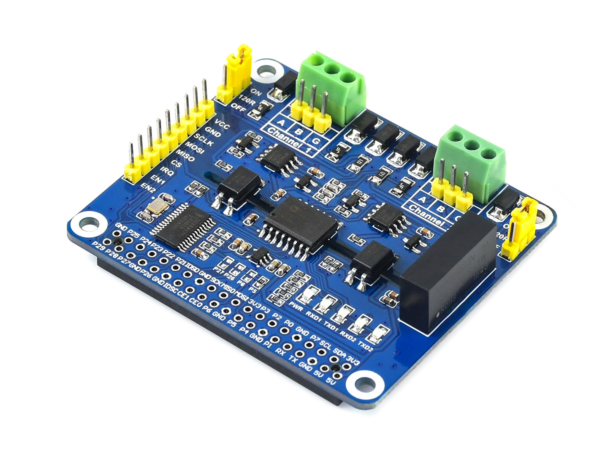

# 2-CH RS485 HAT
## waveshare electronics

http://www.waveshare.net  
https://www.waveshare.com  

## 中文 ## 
http://www.waveshare.net/shop/.htm  
我是专为树莓派设计的双通道隔离型RS485扩展板，采用SC16IS752+SP3485方案，内置电源隔离、ADI磁耦隔离和TVS等保护电路。   
我操作简单，通过SPI接口即可控制两路RS485通信，自动收发转换，具有通信速度快、稳定、可靠、安全等特点，可适用于工业自动化等领域。

## English ##
https://www.waveshare.com/.htm  
I am a dual-channel isolated RS485 expansion board designed for the Raspberry Pi. It uses SC16IS752+SP3485 solution, built-in power isolation, ADI magnetic coupling isolation and TVS protection circuits.  
I am simple to operate, can control two RS485 communication through the SPI interface, automatic transmission and reception conversion, with fast communication, stable, reliable, safe and so on, can be applied to industrial automation and other fields.

